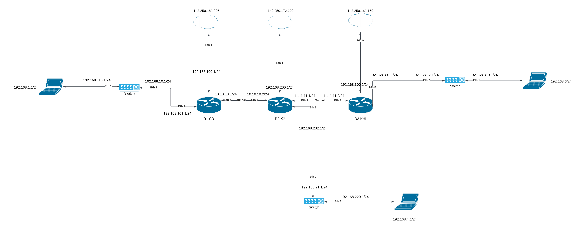

Nama : Imam Mulyana
NIM : 20210801234
Matkul : Jaringan Komputer Lanjut

# ESSAY

1. Routing Static adalah metode routing di jaringan komputer dimana administrator jaringan diatur dengan menentukan rute lalu lintas data antar perangkat secara manual.
2. Routing Dynamic adalah metode routing dimana administrator jaringan router di jaringan komputer diatur secara otomatis dalam menentukan dan memperbarui rute lalu lintas data antar perangkat.
3. Firewall adalah sistem keamanan jaringan yang berguna sebagai penghalang antara jaringan internal dan jaringan eksternal untuk melindungi data dari ancaman dan akses yang tidak sah dengan mengontrol lalu lintas data yang masuk dan keluar berdasarkan aturan keamanan yang telah ditentukan sehingga memungkinkan data yang aman untuk lewat sambil memblokir atau membatasi akses berbahaya.
4. NAT (Network Address Translation) adalah proses yang digunakan untuk mengubah alamat IP pada paket data saat melewati router atau perangkat jaringan lainnya yang memungkinkan perangkat di jaringan lokal dengan alamat IP privat mengakses internet melalui satu alamat IP publik.

# CASED

# Konfigurasi

## Router 1 CR

### Setting IP untuk antarmuka

/ip address add address=192.168.100.1/24 interface=ether1
/ip address add address=10.10.10.1/24 interface=ether4

### Setting IP untuk LAN lokal

/ip address add address=192.168.110.1/24 interface=ether2
/ip address add address=192.168.101.1/24 interface=ether3

### Tunnel ke R2

/interface gre add name=tunnel-to-R2 remote-address=10.10.10.2 local-address=10.10.10.1
/ip address add address=10.10.10.1/24 interface=tunnel-to-R2

### Route ke jaringan lainnya melalui tunnel

/ip route add dst-address=192.168.200.0/24 gateway=10.10.10.2
/ip route add dst-address=192.168.300.0/24 gateway=10.10.10.2
/ip route add dst-address=192.168.12.0/24 gateway=10.10.10.2

## Router 2 KJ

### Setting IP untuk antarmuka

/ip address add address=192.168.200.1/24 interface=ether1
/ip address add address=10.10.10.2/24 interface=ether4

### Tunnel ke R1 dan R3

/interface gre add name=tunnel-to-R1 remote-address=10.10.10.1 local-address=10.10.10.2
/interface gre add name=tunnel-to-R3 remote-address=11.11.11.2 local-address=11.11.11.1
/ip address add address=10.10.10.2/24 interface=tunnel-to-R1
/ip address add address=11.11.11.1/24 interface=tunnel-to-R3

### Route ke jaringan lainnya melalui tunnel

/ip route add dst-address=192.168.100.0/24 gateway=10.10.10.1
/ip route add dst-address=192.168.300.0/24 gateway=11.11.11.2
/ip route add dst-address=192.168.21.0/24 gateway=11.11.11.2

## Router 3 KHI

### Setting IP untuk antarmuka

/ip address add address=192.168.300.1/24 interface=ether1
/ip address add address=11.11.11.2/24 interface=ether4

### Tunnel ke R2

/interface gre add name=tunnel-to-R2 remote-address=11.11.11.1 local-address=11.11.11.2
/ip address add address=11.11.11.2/24 interface=tunnel-to-R2

### Route ke jaringan lainnya melalui tunnel

/ip route add dst-address=192.168.200.0/24 gateway=11.11.11.1
/ip route add dst-address=192.168.100.0/24 gateway=11.11.11.1
/ip route add dst-address=192.168.10.0/24 gateway=11.11.11.1

# Analisa

## Topologi

Topologi yang dibuat ini mencakup tiga kampus (CR, KJ, dan KHI) yang terhubung melalui jaringan WAN menggunakan tunnel. Kampus KJ berfungsi sebagai pusat jaringan yang mengatur lalu lintas data antara kampus CR dan KHI. Setiap kampus memiliki satu router utama yang terhubung ke satu switch lokal dan jaringan LAN di masing-masing kampus.

Setiap router diberi konfigurasi alamat IP pada interface yang terhubung ke LAN lokal dan interface yang terhubung ke jaringan eksternal (WAN/tunnel). Berikut adalah analisis konfigurasi IP:

- Router R1 (CR): Menggunakan jaringan 192.168.110.0/24 dan 192.168.101.0/24 untuk koneksi LAN, dan 192.168.100.1/24 untuk koneksi ke internet.
- Router R2 (KJ - Pusat): Menggunakan jaringan 192.168.200.0/24 untuk LAN dan menjadi router pusat untuk koneksi antar kampus dengan koneksi IP 10.10.10.2/24 ke R1 dan 11.11.11.1/24 ke R3.
- Router R3 (KHI): Menggunakan jaringan 192.168.300.0/24 untuk LAN dan koneksi IP 11.11.11.2/24 ke R2.

Tunnel digunakan untuk menghubungkan router antar kampus, R1 (CR) terhubung ke R2 (KJ) dengan IP tunnel 10.10.10.1/24 dan 10.10.10.2/24.
R3 (KHI) terhubung ke R2 (KJ) dengan IP tunnel 11.11.11.1/24 dan 11.11.11.2/24.
Penggunaan tunnel ini memungkinkan jaringan antar kampus berkomunikasi secara langsung seolah-olah berada dalam satu jaringan yang sama. Dengan topologi ini, setiap kampus dapat mengakses jaringan lokal kampus lainnya melalui routing yang disediakan oleh router pusat (KJ).

Routing digunakan untuk mengarahkan paket antar jaringan melalui router pusat (R2 - KJ).
Di setiap router, ditambahkan rute menuju jaringan lainnya melalui tunnel yang menghubungkan antar kampus:

- R1 memiliki rute menuju jaringan 192.168.200.0/24 (KJ) dan 192.168.300.0/24 (KHI) melalui tunnel ke R2.
- R2 mengatur rute ke semua jaringan (CR dan KHI) sebagai pusat, sehingga semua lalu lintas data antar kampus harus melewati R2.
- R3 memiliki rute menuju jaringan 192.168.100.0/24 (CR) dan 192.168.200.0/24 (KJ) melalui tunnel ke R2.
